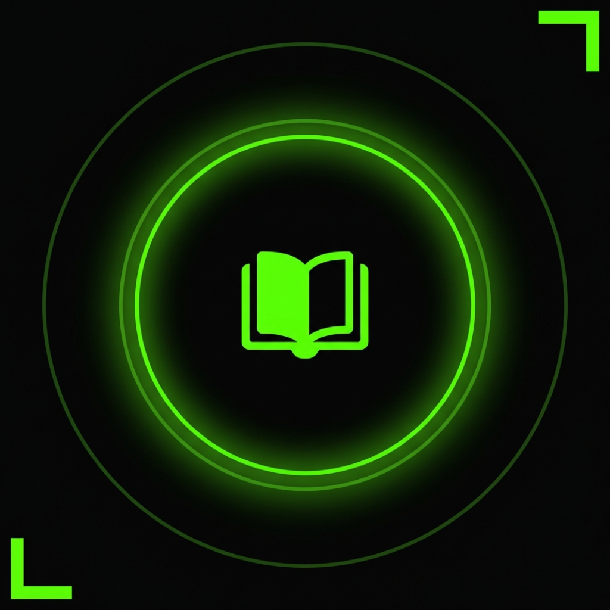
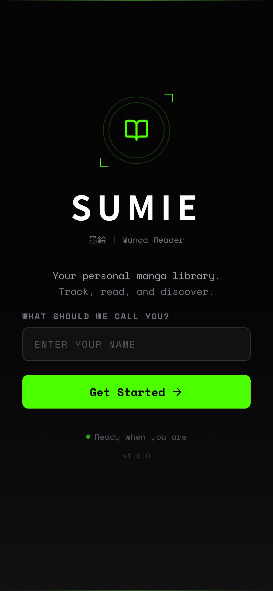
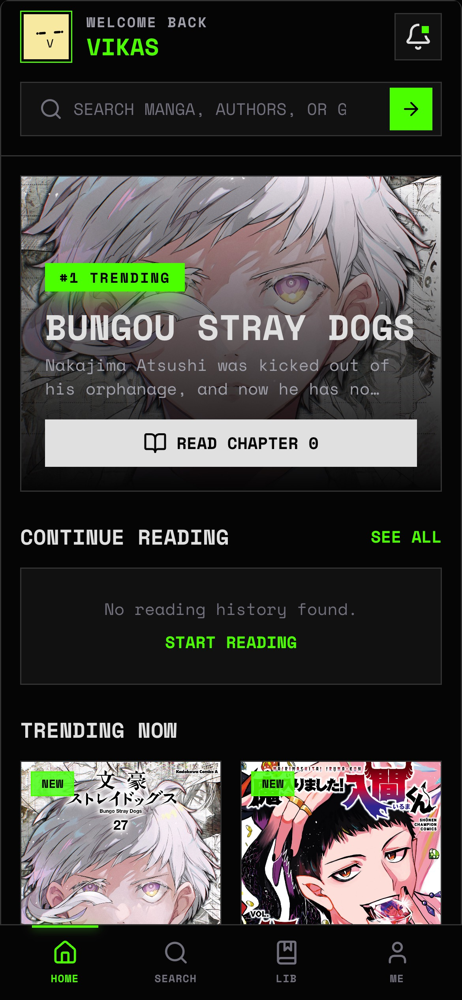
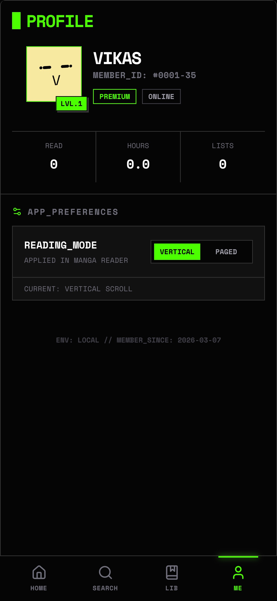
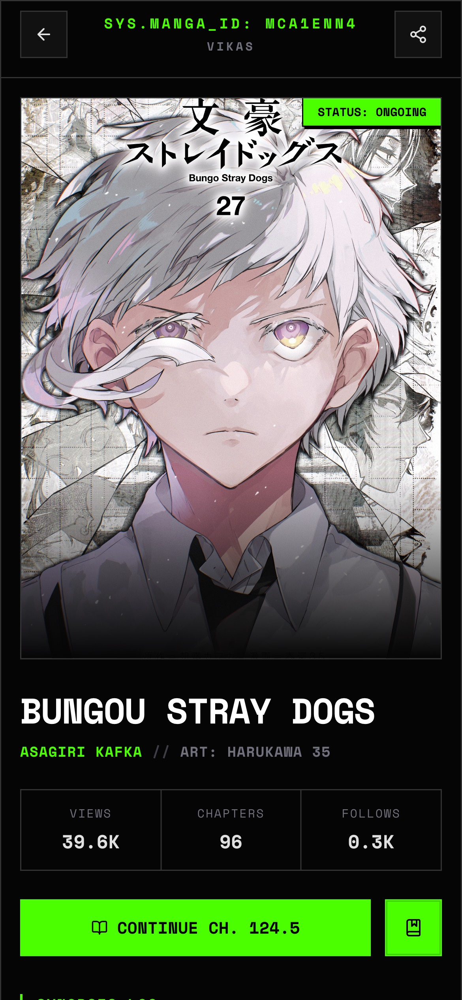
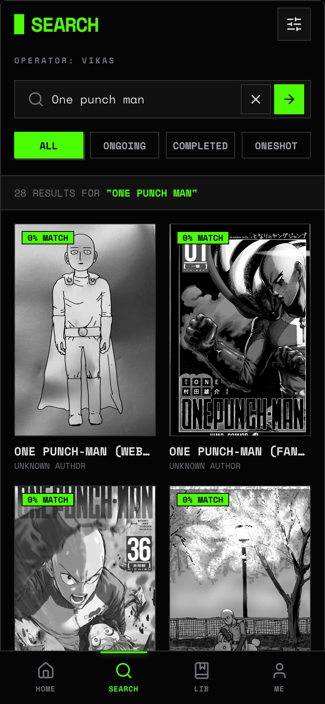
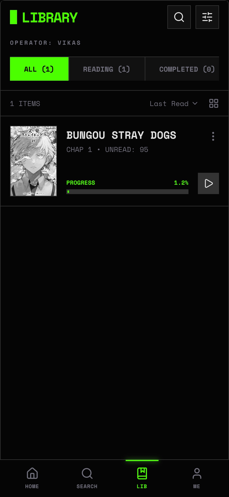
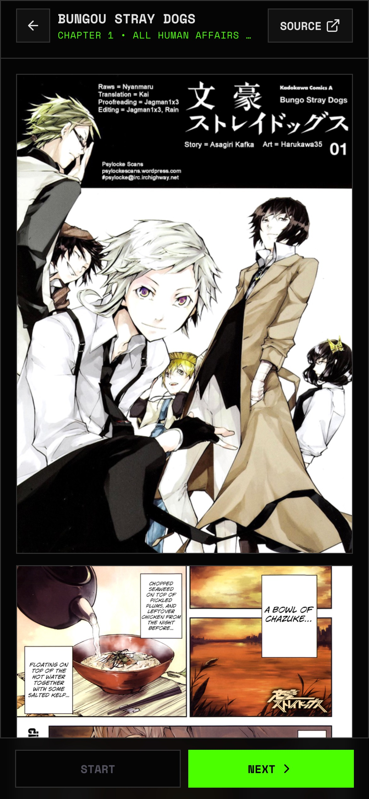

<p align="center">
  
</p>

<h1 align="center">Sumie</h1>

<p align="center">
  <strong>Your personal manga library. Track, read, and discover.</strong>
</p>

<p align="center">
  
  
  
  
  
  
</p>

---

**Sumie** (墨絵 — Japanese for "ink wash painting") is a mobile-first manga reader and library manager built as a native iOS app using [NativePHP Mobile](https://nativephp.com). It runs a full Laravel runtime directly on your device — no server required. Browse trending manga, build your personal library, track reading progress, and read chapters in a beautiful dark-themed interface.

## Screenshots

<p align="center">
  
  &nbsp;&nbsp;
  
  &nbsp;&nbsp;
  
  &nbsp;&nbsp;
  
</p>

<p align="center">
  
  &nbsp;&nbsp;
  
  &nbsp;&nbsp;
  
</p>

## Features

- **Home Feed** — Featured manga, continue reading, trending titles, and personalized recommendations with pull-to-refresh
- **Search** — Real-time search powered by [Weebdex API](https://api.weebdex.com) with status filters (Ongoing / Completed / Oneshot) and recent search history
- **Personal Library** — Organize your collection with status tabs (Reading, Plan to Read, Completed, On Hold, Dropped), sort options, progress tracking, and favorites
- **Manga Detail** — Cover art, metadata, chapter listings, bookmark toggle, and deferred prop loading for smooth UX
- **Reader** — Vertical scroll and page-by-page reading modes with automatic progress tracking and chapter navigation
- **Profile** — Avatar via [facehash](https://github.com/nicbarker/facehash), level system based on reading stats, and reading mode preferences
- **Onboarding** — Simple name entry to create a local device-only user

## Architecture

Sumie is a **NativePHP Mobile** app — it bundles a full PHP runtime with SQLite directly on your iOS device. There is no backend server, no authentication flow, and no cloud dependency for core functionality. All data is stored locally.

```
┌─────────────────────────────────┐
│          iOS Device             │
│  ┌───────────────────────────┐  │
│  │     NativePHP Runtime     │  │
│  │  ┌─────────┐ ┌─────────┐ │  │
│  │  │ Laravel │ │ SQLite  │ │  │
│  │  │   12    │ │   DB    │ │  │
│  │  └────┬────┘ └─────────┘ │  │
│  │       │                   │  │
│  │  ┌────▼────────────────┐  │  │
│  │  │  Inertia.js v2      │  │  │
│  │  │  React 19 + TW v4   │  │  │
│  │  └─────────────────────┘  │  │
│  └───────────────────────────┘  │
│              │                   │
│     ┌────────▼────────┐         │
│     │  Weebdex API    │         │
│     │  (manga data)   │         │
│     └─────────────────┘         │
└─────────────────────────────────┘
```

## Tech Stack

| Layer       | Technology                                        |
|-------------|---------------------------------------------------|
| Runtime     | PHP 8.5, Laravel 12, NativePHP Mobile              |
| Frontend    | React 19, Inertia.js v2, Tailwind CSS v4           |
| Database    | SQLite (on-device)                                  |
| Build       | Vite 7, Bun                                        |
| Routes      | Laravel Wayfinder (typed TypeScript route helpers)  |
| Testing     | Pest v4, PHPUnit 12                                |
| Data Source | Weebdex API (manga catalog, chapters, covers)      |
| Icons       | Material Symbols                                    |
| Avatars     | facehash                                            |

## Design

Sumie uses a dark theme with a neon green (`#4CFF00`) accent color, inspired by military-terminal and cyberpunk aesthetics. Typography combines **Space Mono** (monospace) with **Noto Sans JP** for Japanese text support.

## Data Models

| Model            | Description                                          |
|------------------|------------------------------------------------------|
| `User`           | Local device user (created during onboarding)        |
| `Manga`          | Manga titles with string primary keys from Weebdex   |
| `Chapter`        | Individual chapters linked to manga                  |
| `UserManga`      | Pivot — tracks library status, favorites, progress   |
| `ReadingProgress`| Per-chapter reading position and completion status   |

## Getting Started

### Prerequisites

- PHP 8.5+
- [Bun](https://bun.sh)
- [Composer](https://getcomposer.org)
- [Laravel Herd](https://herd.laravel.com) (recommended)
- Xcode (for iOS builds)

### Installation

```bash
# Clone the repository
git clone https://github.com/your-username/sumie.git
cd sumie

# Install PHP dependencies
composer install

# Install JS dependencies
bun install

# Copy environment file
cp .env.example .env

# Generate application key
php artisan key:generate

# Run database migrations
php artisan migrate

# Build frontend assets
bun run build
```

### Development

```bash
# Start the dev server (Laravel + Vite)
composer run dev

# Or run separately
php artisan serve
bun run dev
```

### Running on iOS

```bash
# Install NativePHP
php artisan native:install

# Run on iOS simulator
php artisan native:run ios
```

### Testing

```bash
# Run all tests
php artisan test --compact

# Run a specific test
php artisan test --compact --filter=ExampleTest
```

## Project Structure

```
app/
├── Http/Controllers/    # Inertia page controllers
├── Models/              # Eloquent models (User, Manga, Chapter, etc.)
├── Services/            # WeebdexApiService (API client with caching)
resources/
├── js/
│   ├── pages/           # React page components (Inertia)
│   ├── components/      # Shared React components
│   └── layouts/         # App layout with bottom navigation
├── css/                 # Tailwind CSS v4 entry point
database/
├── migrations/          # Database schema
├── factories/           # Model factories for testing
├── seeders/             # Database seeders
tests/
├── Feature/             # Feature tests (Pest)
├── Unit/                # Unit tests (Pest)
```

## License

This project is proprietary software. All rights reserved.
